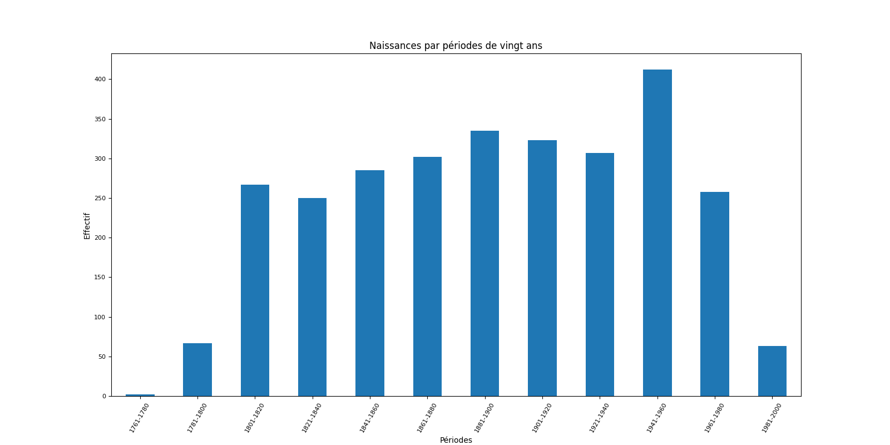
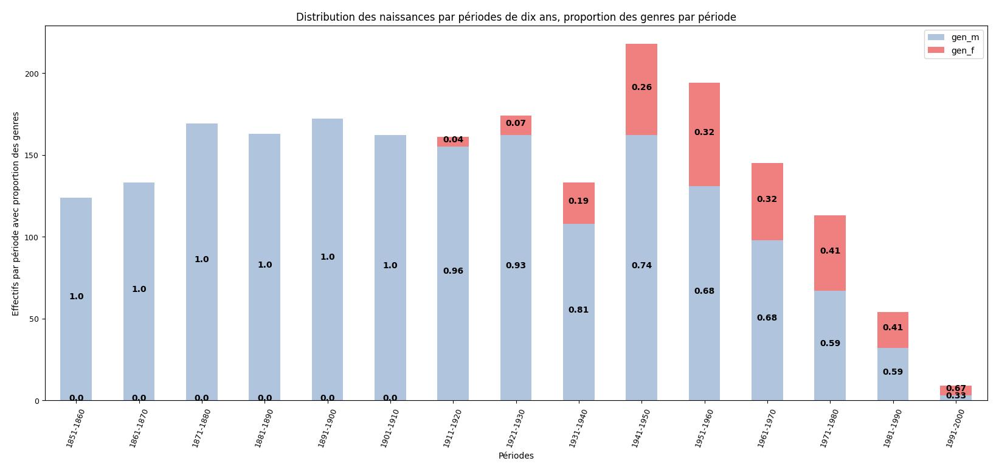

# Analyse des résultats de la distribution de la naissance et du genre

## Les naissances 

L'objectif principal est de connaître l'évolution dans le temps du Conseil national. Dans un premier temps, je me suis demandé quelle génération était le plus représentée. Pour ce faire, j'ai cherché à créer un tableau de distribution des naissances sur une tranche de 20 ans. Il a donc fallu recueillir les données existantes sur wikipédia, puis les répartir sur des périodes de 20 ans. Ce qui est résumé dans le tableau ci-dessous :

En observant ce tableau, on se rend compte d'un certain nombre d'élément. Premièrement, la première personne recensée est née entre 1761 et 1780. Il intéressant de noter que le Conseil national est instauré par la Constitution fédérale de 1848. Dès lors, il paraît logique qu'il n'y ait pas de représentant avant ces dates là. Par ailleurs, ils sont deux : [Vincenzo Dalberti](https://it.wikipedia.org/wiki/Vincenzo_Dalberti), né en 1763, et [Giacomo Ciani](https://de.wikipedia.org/wiki/Giacomo_Ciani), né en 1776.`
Le fait que la première législature date de 1848 corrèle également avec le petit nombre de personne pour la période 1781-1800.

Autre point à relever, le nombre de conseiller augmente de période en période jusqu'à la période 1900. Cela s'explique par le fait que lors de la création de la chambre basse, un élu représentait 20'000 citoyens. Par extension, ils étaient 111 élus en 1848. Le nombre d'élu augmentait donc avec la croissance démographique. Ce n'est seulement à partir de 1963 que le nombre d'élu est fixé à 200.

*Petite apparté : un fait intéressant, c'est que c'est seulement à partir de 1931 qu'une législature dure 4 ans. Avant cette date, c'était trois ans. Cela pourrait aussi expliqué, sachant qu'ils sont sensés être moins d'élu car leur nombre dépend de la population, le pourquoi ils sont pas significativement moins que par la suite. Effectivement, en raccourcissant d'un an la législture, le tournus d'élu se fait plus souvent.*

Mais alors pourquoi la baisse à partir de 1900? À mon avis, c'est dû aux deux guerres mondiales qui ont pu impacter le nombre de naissance pour ces générations là. Mais alors pourquoi il y a un pic pour la période 1941-1960, alors que le début de la période se situe en pleine WWII?

Pour le découvrir, nous allons faire une distribution sur 10 ans.
Dans un esprit de gain de temps et de place, nous allons ajouter à ce graphique la donnée du genre.

Notons encore la baisse de représentants pour les périodes 1961-1980 et 1981-2000, somme toute logique, car les jeunes sont généralement moins représenté dans le parlement. Pour la dernière législature, la 52e, la moyenne d'âge se situe à 49.5 ans, soit 1974 (car l'élection s'est faite en 2023). Cela expliquerait donc cette baisse. Baisse qui se stabilisera avec les années pour ces tranches d'âges là et qui se maintiendra pour les plus jeunes.

## Les naissances et le genre sur  des périodes de 10 ans

La première question que je vais essayer de répondre, c'est donc de savoir si nous obtenons plus d'informaion en faisant des périodes de 10 ans et ainsi déceler une subtilité notamment pour la période 1941-1960.
Deuxièmement, ce graphique permettra d'observer l'évolution du genre au Conseil national.
Pour ce faire, il a donc fallu découper non pas en période de 20 ans, mais de 10, en y ajoutant les données du genre pour comprendre cette évolution. Le tableau commence également seulement à partir de 1851, car au paravant, ce n'est pas intéressant.
C'est ce qui est résumé dans le tableau ci-dessous :

Première constatation, le pic de la période 1941-1950. Une situation aussi compréhensible par le fait du babyboom. Comme il y a plus de naissance dans cette période, il est aussi logique qu'il y ait une plus forte représentation. D'autant plus qu'il s'agit de la tranche d'âge des retraités, qui ont aussi plus de temps pour participer à la vie politique et qui sont donc plus représenté au Parlement.

Concernant le genre, les femmes ont obtenu le droit de vote en Suisse seulement en 1971. Ainsi, il est logique de ne pas les voir avant ces dates. Et c'est le même phénomène qu'avec les hommes : dès que les femmes ont pu être élue, il y a un petit nombre d'entre elle, née entre 1911 et 1920, qui se sont arrivées à l'exécutif. 
Ce qui est également intéressant de constater, c'est la lente évolution jusqu'en 1940. J'explique cela par le fait que comme ces femmes là avait déjà 30, 40, 50 et même 60 ans, elles n'ont, pour la plupart, pas d'éducation et de sensibilité politique, étant donné que c'était un domain réservé aux hommes auparavant. La première tranche d'âge qui commence à être un peu plus fortement représenter, c'est celle de 1941-1950, tranche du babyboom, mais aussi la tranche d'âge qui a grandit avec l'avénements des droits civique. Ce qui expliquerait les 26% de femmes. Phénomène qui s'accentue par la suite.

Un autre point à relever, c'est que seule dans la tranche 1991-2000 