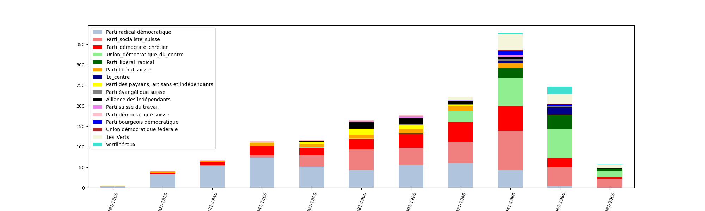
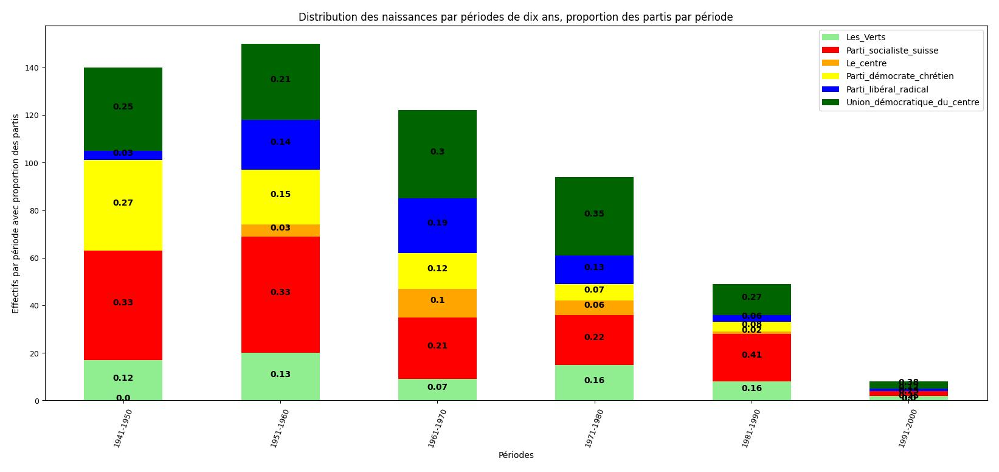
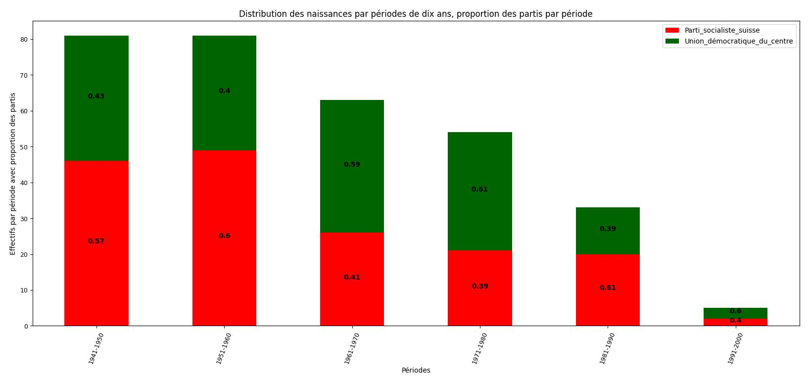

# Analyse des résultats de la distribution de la naissance et du parti

Dans la continuité de découvrir l'évolution du parlement et après avoir découvert que [les naissances et le genre](https://github.com/tbu02/swiss_national_council/blob/main/Documentation/R%C3%A9sultats/Distribution%20naissance%20et%20genre.md) raconte une histoire qui est explicable par les faits historique, je voulais savoir ce qu'il en était de la distribution des naissances par rapport aux partis.

## Les partis populaires

Pour commence j'ai pris les 15 partis les plus populaire dans mon échantillon. Cela concerne donc des partis actuels, mais aussi historiques. Par essayer de comprendre comment à évoluer le Conseil national, j'ai attribué les partis en fonction des naissances des élus sur des périodes de 20 ans. Voici ce que j'obtiens :

Ce n'est effectivement pas très lisible, mais il est intéressant de constater que bon nombre de partis disparaissent. L'histoire nous raconte que soit ces partis fusionne ou change de nom dans la majorité des cas. Ce qui explique pourquoi certains partis ne sont plus représentés à partir d'une certaine année ou pourquoi d'autres apparaissent. L'exemple qui me vient ici en tête, c'est le Parti démocrate-chrétien, qui s'est renommé en Le Centre. Les générations les plus anciennes ne connaissent donc pas le centre et les générations les plus récentes ne connaissent pas le pdc.
Toutefois, comme ce graphique n'est pas très lisible, j'ai décidé d'en faire un nouveau, plus condensé et plus moderne. Le tableau présente les 5 partis les plus populaire aujourd'hui (il y en a un 6e, le pdc, pour justement montrer ce changement de nom). De plus, les périodes sont sur 10 ans et commence à partir de 1941 afin d'avoir l'histoire récente.

Voici le résultat :

Ce tableau est déjà bien plus lisible. Première chose, on peut deviner le changement de nom du Parti démocrate-chrétien, qui devient Le Centre. Toutefois, comme c'est un changement récent, on ne peut pas encore constater une rupture parfaite. Mais on la devine, en observant qu'il n'y a aucun membre de Le Centre avant 1951 et que le PDC perd en force avec les années, justement, car il n'existe plus et ne peux plus être représenté par les jeunes générations. Autre constatation étonnante, toutes les tranches d'âge sont semblable en terme de distribution des partis. On pourrait essayer de deviner une majorité de personne de gauche pour les tranches plus âgés. Mais pour pouvoir différencier gauche et droite, il faudrait être plus précis.
Ainsi, j'ai pris les deux partis les plus populaire en suisse, qui sont diamétralement opposé, avec le PS pour la gauche et l'UDC pour la droite. Voici le tableau :

Il est intéressant aussi de constater qu'il n'y a pas vraiment une tendance quis e dégage. Si l'on sait qu'aujourd'hui la suisse penche plus à droite, ces chiffres ne le relève pas. La tranche d'âge de 1941-1950, 1951-1960 et 1981-1990 est plus à gauche, du moins il y a plus de socialiste. Alors que pour les tranches d'âge de 1961-1970, 1971-1980 et 1991-2000 sont plus à droite, du moins sont UDC. Pourquoi cela? j'avance l'idée que les personnes ayant eu la majorité lors des événements de mai 68 ont grandi dans un environnement plus propice à la gauche et au idée révolutionnaire. Je reste néanmoins surpirs de constater que chez les jeunes, il y a plus d'UDC que de PS, alors que les jeunes sont généralement plus à gauche. Ceci est un point que je ne peux pas expliquer.
Toutefois, si on prends les jeunes, dans le sens plus jeune que la moyenne d'âge au parlement (1974), on constate qu'il y aeffectivement nettement plus de personne qui sont à gauche, notamment la tranche d'âge 1981-1990 qui sont 61%.
Un autre point a relevé, c'est que l'UDC devient une force majeur à partir des années 90. Ce qui pourrait coïncider avec le changement de la majorité dans ce tableau à partir des naissances des années 70.

## Conclusion
Pour répondre à la question de recherche, à savoir, y a-t-il une évolution des partis au Parlement? La réponse est oui. Mais cette évolution est dû au changement structurel (nom de parti, fusion,...) plutôt que dû au changement de moeurs ou d'opinion. En terme d'échelle politique. Le parlement reste relativement stable et cela se ressent aussi dans la politique suisse : la démocratie suisse est réputé pour sa stabilité.

### Limite
Une des limites pour pouvoir analyser cette évolution, c'est qu'elle se base sur les naissances et non pas sur l'année d'élection. Cela pourrait plus simplement décrir la réalité du terrain. Le problème étant qu'avec les naissances, il nous manque l'information de la législture.